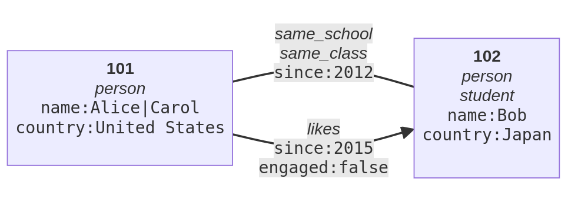

# pgraphs

> Property Graph Exchange Format (PG) converters

This package implements parsers and serializers to convert between labeled property graph formats and databases.

## Table of Contents

- [Background](#background)
- [Install](#install)
- [Usage](#usage)
  - [API](#api)
  - [CLI](#cli)
- [Formats](#formats)
  - [PG format](#pg-format)
  - [PG JSON and JSONL](#pg-json-and-jsonl)
  - [GraphViz DOT](#graphviz-dot)
  - [GraphML](#graphml)
  - [Cypher CREATE](#cypher-create)
  - [YARS-PG](#yars-pg)
  - [CSV](#csv)
  - [Neptune CSV](#neptune-csv)
  - [TGF](#tgf)
  - [JSON Canvas](#json-canvas)
  - [Mermaid](#mermaid)
  - [Graphology](#graphology)
  - [NCOL](#ncol)
- [Databases](#databases)
  - [Neo4J](#neo4j)
- [License](#license)

## Background

A **property graph** (also known as **labeled property graph**) is an abstract
data structure consisting of **nodes** and (possibly directed) **edges**
between these nodes. Nodes and edges can each have **labels** and
**properties**. Property graph [formats and databases](#formats) slightly
differ in their data model by restrictions, support of data types etc.

This package implements the **[Property Graph Exchange Format (PG)](#pg-format)**,
aimed to be a superset of common models, with parsers and serializers from and to
various formats.

## Install

Requires node >= 18.0.0 for use and >= 20.0.0 for development.

~~~
npm install -g pgraphs
~~~

To [connect to Neo4J databases](#neo4j), also install:

~~~
npm install -g neo4j-driver-lite
~~~

Browser bundles have not been created yet.

## Usage

### CLI

Command `pgraph` is installed with this package:

~~~
Usage: pgraph [options] [<source> [<target>]]

Convert between property graph formats and databases.

Options:
  -f, --from [format]   source format
  -t, --to [format]     target format
  -e, --errors          verbose error messages
  -i, --id [key]        copy node id to property
  -h, --html            generate HTML label (experimental)
  -s, --scale [factor]  scale spatial properties x,y,width,height,pos
  -h, --help            show usage information
  -V, --version         show the version number

Supported conversion formats:
  pg         from/to PG format (default source format)
  json       from/to PG-JSON
  jsonl      from/to PG-JSONL (default target format)
  cypher     from/to Cypher CREATE statements
  neo4j      from/to Neo4J database (via Cypher query)
  dot        from/to GraphViz DOT
  tgf        from/to Trivial Graph Format
  canvas     from/to JSON Canvas (experimental)
  graphology from/to Graphology import/export
  ncol       from/to NCOL file format
  xml        to GraphML
  yarspg     to YARS-PG 5.0.0 without data types
  yarspg3    to YARS-PG 3.0.0 with optional labels
  csv        to OpenCypher/Neo4J CSV files
  neptune    to Neptune CSV import (aka Gremlin load data format)
  mmd        to Meermaid Flowchart (experimental)
~~~

### API

Programming API may still change. Try this or look at the sources:

~~~
import { pgformat, ParsingError } from "pgraphs"

const graph = {
  nodes: [ ... ],
  edges: [ ... ] 
}

try {
  const pgstring = pgformat.pg.serialize(graph)
  const graph = pgformat.pg.parse(pgstring)
} catch (ParsingError e) {
  console.log(`Parsing failed in line ${e.line}`)
}
~~~

## Formats

Many formats and conventions exist to store labeled property graphs. Each
format comes with a syntax and a limited or extended data model of property
graphs: not every feature can be expressed in every format! The following table
lists all formats and systems known by know and whether they can be read and/or
written from with this package:
 
| read | write | format or database                      |
|------|-------|-----------------------------------------|
| yes  | yes   | [PG format](#pg-format)                 |
| yes  | yes   | [PG-JSON](#pg-json-and-jsonl)           |
| yes  | yes   | [PG-JSONL](#pg-json-and-jsonl)          |
| yes  | yes   | [Cypher CREATE](#cypher-create)         |
| yes  | yes   | [GraphViz DOT](#graphviz-dot)           |
| yes  | yes   | [Trivial Graph Format (TGF)](#tgf)      |
| yes  | yes   | [JSON Canvas](#json-canvas)             |
| yes  | yes   | [Graphology](#graphology)               |
| yes  | yes   | [NCOL](#ncol)                           |
|      | yes   | [GraphML](#graphml)                     |
|      | yes   | [YARS-PG](#yars-pg)                     |
|      | yes   | OpenCypher/Neo4J [CSV](#csv)            |
|      | yes   | Amazon [Neptune CSV](#neptune-csv)      |
|      | yes   | [Mermaid](#mermaid)                     |
| yes  | -     | Cypher MATCH query                      |

The repository of pgraphs contains [a CSV
file](https://github.com/pg-format/pgraphs/blob/main/docs/features.csv)
and equivalent [pg file](https://github.com/pg-format/pgraphs/blob/main/docs/features.pg)
listing these and more graph formats with their capabilities to store
[selected graph features](https://github.com/pg-format/pgraphs/blob/main/docs/features.md).

### PG format

PG format was first proposed by Hirokazu Chiba, Ryota Yamanaka, and Shota
Matsumoto ([2019](https://arxiv.org/abs/1907.03936),
[2022](https://arxiv.org/abs/2203.06393)). A revision is currently taking place
to get to a final specification.

The [following graph](examples/example.pg) in **PG format** with two nodes and
two edges uses features such as multiple labels, and property values, numbers
and boolean values:

~~~
101 :person name:Alice name:Carol country:"United States"
102 :person :student  name:Bob  country:Japan
101 -- 102  :same_school  :same_class  since:2012
101 -> 102  :likes  since:2015  engaged:false
~~~

See also:

- [PG format grammar as railroad diagram](https://github.com/pg-format/pgraphs/blob/main/docs/pg-grammar.md)
- [web application to beautify PG format](https://pg-format.github.io/pg-formatter/)
- [planned formal specification of PG data model and format](https://github.com/pg-format/specification/)
- [illustrating example of PG format](https://github.com/pg-format/pgraphs/blob/main/docs/pg-format.pg)
- [Example directory](https://github.com/pg-format/pgraphs/blob/main/examples), also used for unit tests

### PG JSON and JSONL

The same graph [in PG-JSON](examples/example.json) and [in PG-JSONL](examples/example.jsonl):

~~~json
{
  "nodes": [{
    "id": "101", "labels": [ "person" ],
    "properties": { "name": [ "Alice", "Carol" ], "country": [ "United States" ] }
   },{
    "id": "102", "labels": [ "person", "student" ],
    "properties": { "name": [ "Bob" ], "country": [ "Japan" ] }
  }],
  "edges": [{
    "from": "101", "to": "102", "undirected": true,
    "labels": [ "same_school", "same_class" ], "properties": { "since": [ 2012 ] }
   },{
    "from": "101", "to": "102",
    "labels": [ "likes" ], "properties": { "engaged": [ false ], "since": [ 2015 ] }
  }]
}
~~~

~~~json
{"id":"101","labels":["person"],"properties":{"name":["Alice","Carol"],"country":["United States"]}}
{"id":"102","labels":["person","student"],"properties":{"name":["Bob"],"country":["Japan"]}}
{"from":"101","to":"102","labels":["same_school","same_class"],"properties":{"since":[2012]},"undirected":true}
{"from":"101","to":"102","labels":["likes"],"properties":{"since":[2015],"engaged":[false]}}
~~~

There is also a [JSON Schema for PG-JSON](https://github.com/pg-format/specification/raw/main/schema/pg-json.json).
and a [JSON Schema for PG-JSONL](https://github.com/pg-format/specification/raw/main/schema/pg-jsonl.json).

### GraphViz DOT

When exported [to GraphViz DOT](examples/example.dot) format, labels are ignored:

~~~dot
graph {
  101 [country="United States" name=Alice];
  102 [country=Japan name=Bob];
  101 -- 102 [since=2012];
  101 -> 102 [since=2015];
}
~~~

Parsed again from dot to PG format all edges are undirected, except for digraphs:

~~~
101 country:"United States" name:Alice
102 country:Japan name:Bob
101 -- 102 since:2012
101 -- 102 since:2015
~~~

### GraphML

When exported [to GraphML](examples/example.xml), labels are ignored and all
values are converted to strings:

~~~xml
<?xml version="1.0" encoding="UTF-8"?>
<graphml xmlns="http://graphml.graphdrawing.org/xmlns">
  <graph edgedefault="undirected">
    <node id="101">
      <data key="country">United States</data>
      <data key="name">Alice</data>
      <data key="name">Carol</data>
    </node>
    <node id="102">
      <data key="country">Japan</data>
      <data key="name">Bob</data>
    </node>
    <edge source="101" target="102">
      <data key="since">2012</data>
    </edge>
    <edge source="101" target="102">
      <data key="engaged">false</data>
      <data key="since">2015</data>
    </edge>
  </graph>
</graphml>
~~~

### Cypher CREATE

The example graph in [Cypher language](https://opencypher.org/references/) with
CREATE statements. The undirected edge is ignored because Cypher only supports
directed edges:

~~~
CREATE (`101`:person {name:["Alice","Carol"], country:"United States"})
CREATE (`102`:person:student {name:"Bob", country:"Japan"})
CREATE (`101`)-[:likes {since:2015, engaged:false}]->(`102`)
~~~

Further differences between PG data model and Cypher include no support of
`null` in property values and mixed types in repeated property values.

### YARS-PG

Export to YARS-PG 5.0.0 is limited to nodes and edges without schema, so all
property values are mapped to strings:

~~~
(node1{"person"}["country":"United States","name":["Alice","Carol"]])
(node2{"person","student"}["country":"Japan","name":"Bob"])
(node1)-["same_school"]["since":"2012"]-(node2)
(node1)-["likes"]["engaged":"false","since":"2015"]-(node2)
~~~

YARS-PG 3.0.0 supported data types without a schema but labels were mandatory.
The exported format variant lifts this restriction, so the graph [in this
format](examples/example.yarspg) is very similar to [PG format](#pg-format):

~~~
<"101">{"person"}["country":"United States","name":["Alice","Carol"]]
<"102">{"person","student"}["country":"Japan","name":"Bob"]
("101")-["same_school"]["since":2012]-("102")
("101")-["likes"]["engaged":false,"since":2015]-("102")
~~~

### CSV

Property graphs can be stored in form of separate CSV files for nodes and
edges, respectively. An nearly common form these files is supported by Neo4J as
[CSV header format] and by Amazon Neptune as [OpenCypher CSV format]. pgraph
creates four files in `csv` format using the `output` as base name (with
optional directory):

- base + `.nodes.headers` and base + `.nodes.csv` with node data
- base + `.edges.header`, and base + `.edges.csv` with edge data

The example graph is serialized as following, in four files:

~~~csv
:START_ID,:END_ID,:TYPE,since:int,engaged:boolean

101,102,same_school,2012
101,102,likes,2015,false

:ID,:LABEL,name:string[],country:string

101,person,Alice;Carol,United States
102,person;student,Bob,Japan
~~~

Repeated labels and property values are separated by semicolon so this
character is automactially stripped from labels and property values.
Configuration of this character to some other value is not supported yet.

[Imported into a Neo4J database](#neo4j) and exported again is serialized as
following in PG. Thus conversion of property graphs between PG and Neo4J or
Neptune should be round-trip apart from identifiers, undirected edges,
semicolon, and support of additional data types:

~~~
1 :person country:"United States" name:Alice name:Carol
2 :person :student country:Japan name:Bob
1 -> 2 :same_school since:2012
1 -> 2 :likes engaged:false since:2015
~~~

[CSV header format]: https://neo4j.com/docs/operations-manual/current/tools/neo4j-admin/neo4j-admin-import/#import-tool-header-format 
[OpenCypher CSV format]: https://docs.aws.amazon.com/neptune/latest/userguide/bulk-load-tutorial-format-opencypher.html

### Neptune CSV

Amazon Neptune graph database also supports import of property graph data in
a CSV format called [Gremlin load data
format](https://docs.aws.amazon.com/neptune/latest/userguide/bulk-load-tutorial-format-gremlin.html)
(but only by Amazon, not by Apache TinkerPop community). This CSV format is very similar to
the more common [CSV](#csv) format but it also allows to use semicolon in values, escaped as `\;`.

The example graph is serialized as following, in two files:

~~~csv
~id,~label,name:String[],country:String
101,person,Alice;Carol,United States
102,person;student,Bob,Japan

~id,~from,~to,~label,since:Int,engaged:Bool
0,101,102,same_school,2012
1,101,102,likes,2015,false
~~~

### TGF

The [Trivial Graph Format](https://en.wikipedia.org/wiki/Trivial_Graph_Format)
(TGF) is a text-based format to exchange labeled graphs. It does not support
properties, multiple labels nor line breaks in labels. The example graph is
serialized as following:

~~~tgf
1 person
2 person
#
1 2 same_school
1 2 likes
~~~

Parsed back from TGF and serialized as PG format, this is equivalent to:

~~~
1 :person
2 :person
1 -> 2 :same_school
1 -> 2 :likes
~~~

### JSON Canvas

The spatial hypertext [JSON Canvas format](https://jsoncanvas.org/) can store
a spatial graph with nodes of text (in Markdown), links, or files. Each node
requires a position and size at least. The corresponding properties (`with`,
`height`, `x`, `y`) are not included in the example graph but GraphViz can be
used to generate them. As GraphViz uses dpi instead of pixel, the numbers
should be scaled with pgraph option `--scale`. This command line pipeline
generates a JSON Canvas from the example graph:

~~~
pgraph examples/example.pg -t dot | dot | pgraph -f dot -s 4 -t canvas
~~~

To transform a DOT file `graph.dot` into JSON Canvas:

~~~
dot graph.dot | pgraph -f dot -s 4 -t canvas > graph.canvas
~~~

JSON Canvas can be read as well, but not all features are supported.

### Mermaid

Export to Mermaid is experimental and may lead to syntactically invalid Marmaid
files because there is no formal specification and because some characters
cannot be escaped. Mermaid supports HTML in names of nodes and edges (property
`name`)  but HTML attributes must be single-quoted (`<a href='...'` instead of
`<a href="..."`) and numeric character entities cannot be used.

By default the example graph is exported to this Mermaid diagram source:

~~~mmd
flowchart LR
    101["Alice"]
    102["Bob"]
    101 --- 102
    101 --> 102
~~~

With experimental option `--html` the full labels and properties of nodes and edges are converted to HTML labels, resulting in the following diagram:

[mermaid-cli](https://www.npmjs.com/package/@mermaid-js/mermaid-cli) can be
used to generate SVG files from Mermaid diagram files.

### NCOL

The NCOL file format is used to visualize very large undirected graphs with
[Large Graph Layout](https://github.com/TheOpteProject/LGL) software. The graph
is eventually reduced to simple edges with optional weight, but extensions
exist for coloring and node labels (not supported by this library).

## Databases

pgraphs can directly connect to some graph databases for import and/or export.

### Neo4J

Format `neo4j` requires to install node package `neo4j-driver` (done
automatically by calling `npm install` unless pgraphs package is installed as
dependency of another project) and expects a JSON file with Neo4J database
Bolt-API URI and credentials as source or target. Use the following for
a default installation on your local machine:

~~~json
{
  "uri": "neo4j://localhost",
  "user": "",
  "password": ""
}
~~~

Reading from a database uses a Cypher `MATCH` query. Writing into a database
uses the list of Cypher `CREATE` queries as exported with [Cypher target
format](#cypher-create), so the following should be equivalent:

- `pgraphs graph.pg query.cypher` and manually execute query `query.cypher`
- `pgraphs -t neo4j pgraph.pg neo4j.json`

For larger graphs better export in [CSV format](#csv) to multiple files and
bulk import the CSV files with `neo4j-admin database import`. Note that CSV
format cannot express semicolon in repeated property values! Cypher command
`LOAD CSV` will not work because it expects an additional `MERGE` clause and
node/edges must have uniform labels.

The [pgraphs git repository](https://github.com/pg-format/pgraphs/) contains
shell scripts [in directory neo4j](https://github.com/pg-format/pgraphs/blob/main/neo4j/)
to run a local Neo4J instance with Docker and to bulk import CSV files from
local directly `./import`.

## License

Licensed under the MIT License.

A first version of the PG model and its serializations **PG format** and
**PG-JSON** have been proposed by Hirokazu Chiba, Ryota Yamanaka, and Shota
Matsumoto ([2019](https://arxiv.org/abs/1907.03936),
[2022](https://arxiv.org/abs/2203.06393)).

