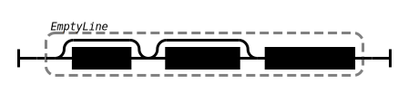
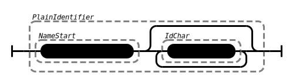
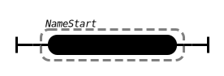

This page illustrates the grammar of **PG format** as railroad diagram. The diagrams have been [generated automatically](https://github.com/peggyjs/peggy-tracks) from the [reference grammar](../src/pg.pegjs) so they are guaranteed to match the implementation.

*Some details of PG formats are [still being discussed](https://github.com/pg-format/pg-formatter/discussions) so this may change!*

### Basic structure

A property graph (**PG**) is encoded in PG format in Unicode as sequence of
[**Entities**](#entities). Empty lines with optional space and comment are
ignored:

An entity is a **node** or **edge**. Optional space and comment are ignored.
Entities are separated from each other with line breaks or semicolon
(`U+003B`):

### Spaces and Comments

Any sequence of consecutive carriage return (`U+000D`) and/or line feed
(`U+000A`) is a **line break** and any sequence of space (`U+0020`) and/or
tabular (`U+0009`) is a **space**:

 

**Empty lines** can contain space and a comment. A comment starts with a hash
(`U+0023`) and it ends at the next line break or at the end of input.

All elements of an entity must be separated by **Whitespace**. This can either
be a space or a line break, if the next line starts with a space. Trailing
space, comment and empty lines are ignored in between: 

### Entities

An entity is either a **node** with its node identifier or an **edge** with two
node identifiers connected via a direction. Both nodes and edges can be
followed by optional labels and properties.

A **label** is an identifier preceded by whitespace and a colon. Space is
allowed between colon and the identifier:

A **property** is preceded by whitespace and it consists of a key and a non-empty list of comma-separated values:

*FIXME: the ValueList diagram is misleading*

### Identifiers and Property Keys

An **identifier** is either given as quoted string or in plain form. A plain
identifier must not contain spaces, tabs, or quotation marks and it must not
start with colon, comma, opening parenthesis or hash:

A property **key** is an identifier followed by a colon:

### Property Values

An individual **value** can be given strictly following JSON grammar (RFC 7159)
or as unquoted string. The latter is like a plain identifier but in addition it
must not contain colon, comma, nor semicolon:

