This page illustrates the grammar of **PG format** as railroad diagram. The diagrams have been [generated automatically](https://github.com/peggyjs/peggy-tracks) from the [reference grammar](../src/pg.pegjs) so they are guaranteed to match the implementation.

*Some details of PG formats are [still being discussed](https://github.com/pg-format/pg-formatter/discussions) so this may change slightly!*

### Contents

- [Basic structure](#basic-structure)
- [Entities](#entities)
- [Labels and properties](#labels-and-properties)
- [Identifiers](#identifiers)
- [Values](#values)
- [Space and Comments](#space-and-comments)
- [Graph features not supported](#graph-features-not-supported)

### Basic structure

PG format allows to express of [nodes and edges](#entities) with optional
[labels and properties](#labels-and-properties) having [values](#values).

A property graph (**PG**) is encoded in PG format as sequence of
[**entities**](#entities) (nodes and edges). Entities are separated from each
other with a line break or with a vertical bar (`U+007C`). [trailing
space](#space-and-comments) in form of space and/or or comments is ignored
after entities and in form of empty lines.

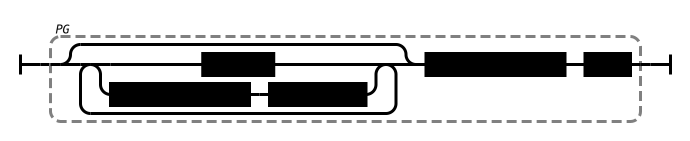

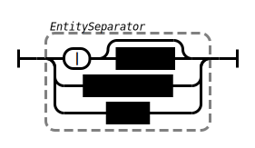

**Example:** the following file contains of three nodes `a`, `b`, `c`, and `d`:

~~~pg
a

b # comment
c|d
~~~

### Entities

An entity is either a **node** or an **edge**. 

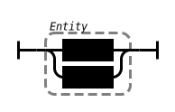

A **node** consists of an [identifier](#identifiers) optionally followed by
[labels and properties](#labels-and-properties).

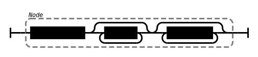

An **edge** consists of an optional edge identifier and two node identifiers
connected via a direction, optionally followed by [labels and
properties](#labels-and-properties).

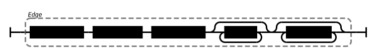

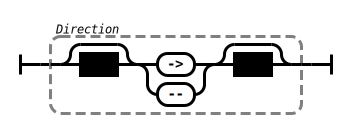

Additional rules not properly expressed in the syntax diagram:

- Both node identifiers of an edge are mandatory, only the edge identifier is optional

- [whitespace](#space-and-comments) before a direction is mandatory 
  when following an unquoted identifier.

### Labels and properties

A **label** is an [identifier](#identifiers) preceded by whitespace and a colon.
Space is allowed between colon and the identifier:

A **property** is preceded by whitespace and it consists of a key and
a non-empty list of comma-separated [values](#values):

**Example:** the following graph consists of two nodes `a` and `b`, both with label
`person`, and an edge from `a` to `b`. The node `a` and the edge both have
a property:

~~~pg
a :person age:42
b :person
a -> b :knows since:2020
~~~

### Identifiers

An **identifier** is either given as quoted string or unquoted. An unquoted
identifier must not contain spaces, tabs, or any of the characters `"`, `|`,
`<`, `>`, `\ `, and `^`. It further must not start with colon (`:`), minus
(`-`), opening parenthesis (`(`), or hash (`#`). These restrictions do not
apply for quoted identifiers but identifiers must never be the empty string:

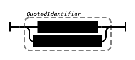

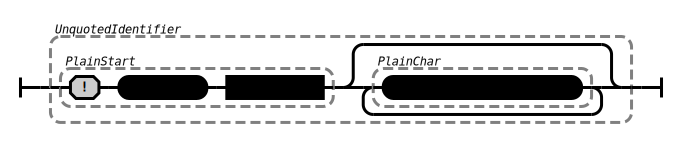

A property **key** is an identifier followed by a colon. If given unquoted, the
first colon is read as end of the identifier, unless followed by a space:

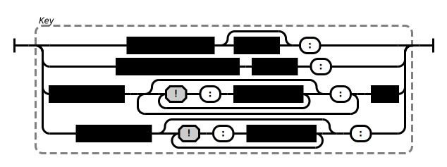

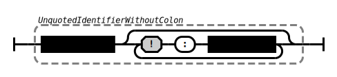

An **edge identifier** must directly be followed by a colon and whitespace:

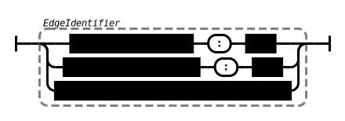

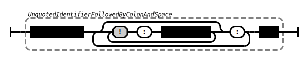

**Example:** Unquoted identifiers allow to directly use numbers and URIs:

~~~pg
1 dc:date: 2024 url:http://example.org/ 
http://example.org/a -> http://example.org/b 
~~~

~~~pg
node a:b:c   # read as node "a": "b:c"
node a:b: c  # read as node "a:b": "c"
~~~

### Values

An individual **value** can be given strictly following JSON grammar (RFC 7159)
or as unquoted string. The latter is like an unquoted [identifier](#identifiers)
but in addition it must not contain comma (`,`). In addition to JSON strings, quoted string can also use the escape sequence `\'` and can use single quotes (`'`) instead of double quotes (`"`):

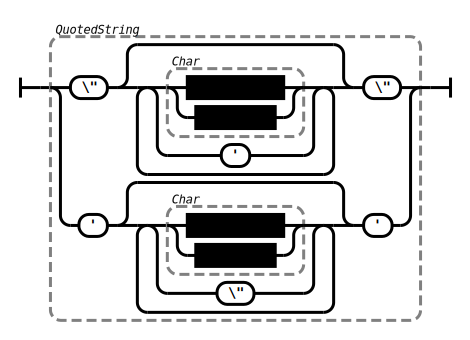

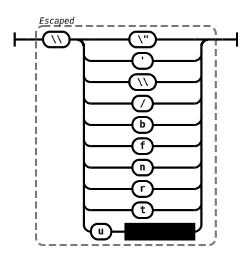

**Note:** Excplicit double quotes are wrongly shown as `\"` instad of `"` in the syntax diagram.

**Example:** the following node has a property `key` with thre values `1`, `2`,
and `3`. The example also illustrates line folding with
[whitespace](#spaces-and-comments):

~~~pg
node
  key:  1
  key : 2,3
~~~

### Space and Comments

Any sequence of consecutive carriage return (`U+000D`) and/or line feed
(`U+000A`) is a **line break** and any sequence of space (`U+0020`) and/or
tabular (`U+0009`) is a **space**:

 

A **comment** starts with a hash (`U+0023`) and it ends at the next line break
or at the end of input. Note that the hash character is allowed in unquoted
[identifiers](#identifiers) and in [values](#values), so most comments must be
preceded by space.

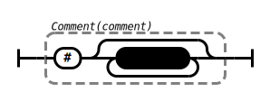

**Trailing space** consists of optional space and comment:

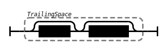

**Whitespace** (**WS**) is required to separate elements of an
[entity](#entities). Whitespace can include a line break and trailing space, if
the next line starts with a space ("line folding").

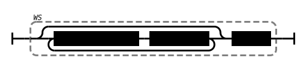

### Graph features not supported

PG format does not support graph attributes, hyper-edges (edges between more or
less than two nodes), hierarchies/sub-graphs, graph schemas, and data types
beyond number and string.
