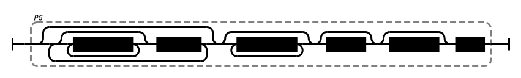
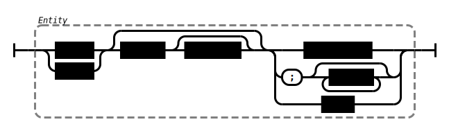
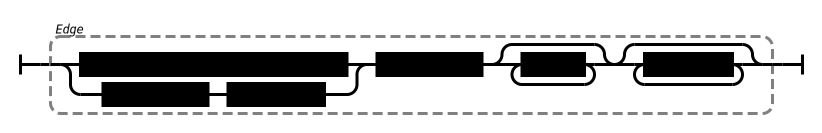
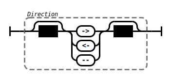
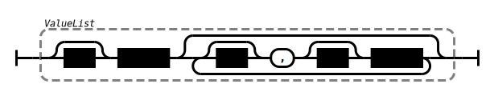
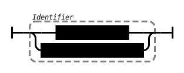
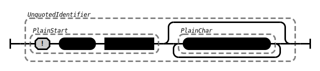
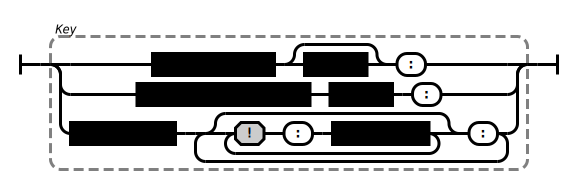
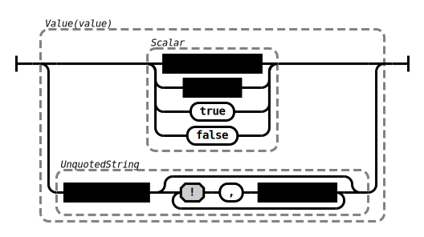

This page illustrates the grammar of **PG format** as railroad diagram. The diagrams have been [generated automatically](https://github.com/peggyjs/peggy-tracks) from the [reference grammar](../src/pg.pegjs) so they are guaranteed to match the implementation.

In short, PG format consists of [nodes and edges](#entities) with optional
[labels and properties](#labels-and-properties) having [values](#values).

*Some details of PG formats are [still being discussed](https://github.com/pg-format/pg-formatter/discussions) so this may change slightly!*

### Basic structure

A property graph (**PG**) is encoded in PG format as sequence of
[**entities**](#entities). Empty lines of [space and
comments](#space-and-comments) are ignored.

An entity is either a **node** or an **edge**. Entities are separated from each
other with a line break or a vertical bar (`U+007C`). Space and comment are
ignored, if following the entity on the same line.

**Example:** the following file contains of three nodes `a`, `b`, `c`, and `d`:

~~~pg
a

b # comment
c|d
~~~

### Entities

A **node** consists of an [identifier](#identifiers) optionally followed by
[labels and properties](#labels-and-properties).

An **edge** consists of two node identifiers connected via a direction,
optionally followed by [labels and properties](#labels-and-properties).

Note that [whitespace](#space-and-comments) around direction is optional 
but required before direction `--` and `->` if the minus character could
directly follows an unqouted identifier.

### Labels and properties

A **label** is an [identifier](#identifiers) preceded by whitespace and a colon.
Space is allowed between colon and the identifier:

A **property** is preceded by whitespace and it consists of a key and
a non-empty list of comma-separated [values](#values):

**Example:** the following graph consists of two nodes `a` and `b`, both with label
`person`, and an edge from `a` to `b`. The node `a` and the edge both have
a property:

~~~pg
a :person age:42
b :person
a -> b :knows since:2020
~~~

### Identifiers

An **identifier** is either given as quoted string or unquoted. An unquoted
identifier must not contain spaces, tabs, or any of the characters `"`, `|`,
`<`, `>`, `\ `, and `^`. It further must not start with colon (`:`), comma
(`,`), opening parenthesis (`(`) or hash (`#`):

A property **key** is an identifier followed by a colon:

**Example:** Unquoted identifiers allow to directly use numbers and URIs:

~~~pg
1 dc:date:2024 url: http://example.org/ 
http://example.org/a -> http://example.org/b 
~~~

### Values

An individual **value** can be given strictly following JSON grammar (RFC 7159)
or as unquoted string. The latter is like an unquoted [identifier](#identifiers)
but in addition it must not contain comma (`,`):

**Example:** the following node has a property `key` with thre values `1`, `2`,
and `3`. The example also illustrates line folding with
[whitespace](#spaces-and-comments):

~~~pg
node
  key:  1
  key : 2,3
~~~

### Space and Comments

Any sequence of consecutive carriage return (`U+000D`) and/or line feed
(`U+000A`) is a **line break** and any sequence of space (`U+0020`) and/or
tabular (`U+0009`) is a **space**:

 

A **comment** starts with a hash (`U+0023`) and it ends at the next line break
or at the end of input.

Note that the hash character is allowed in unquoted [identifiers](#identifiers)
and in [values](#values), so most comments must be preceded by space.
**Ignorable space** consists of optional space and comment:

**Whitespace** is required to separate elements of an [entity](#entities).
Whitespace can include a line break and ignorable space if the next line starts
with a space ("line folding").

