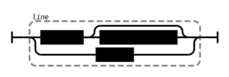
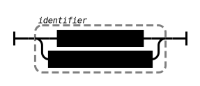
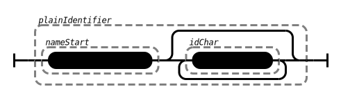
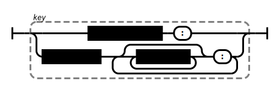
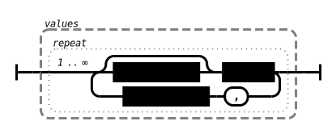
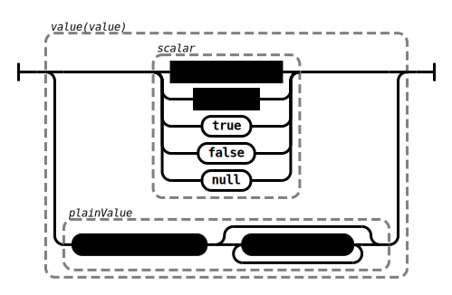
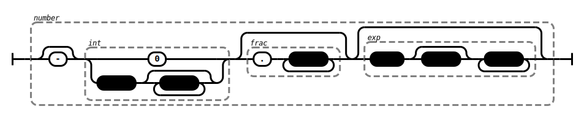
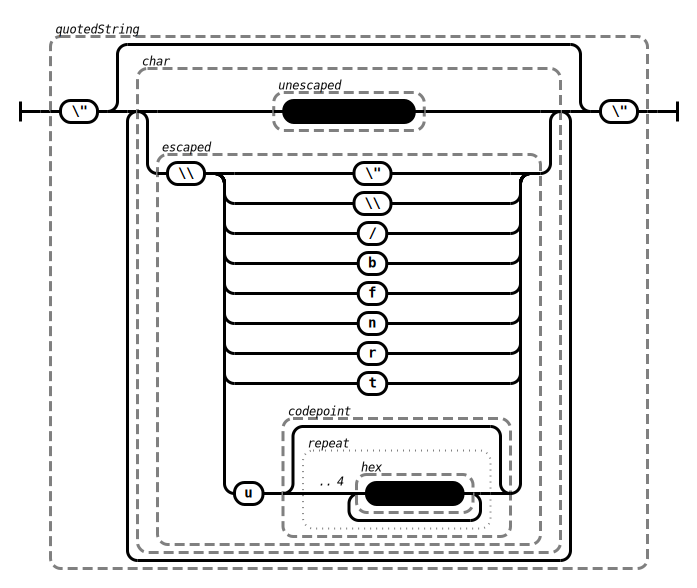
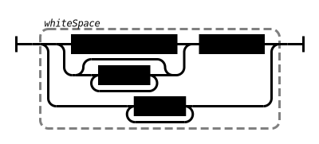

This page illustrates the grammar of **PG format** as railroad diagram. The diagrams have been [generated automatically](https://github.com/peggyjs/peggy-tracks) from the [reference grammar](../src/pg.pegjs) so they are guaranteed to match the implementation. Note that some details of PG formats are [still being discussed](https://github.com/g2glab/pg-formatter/discussions) so this may change!

A **PG format file** consists of a sequence of lines:

A line either contains an entity or it is empty. Trailing spaces and optional comment are ignored:

An entity is either a **node** with its node identifier or an **edge** with two node identifiers connected via a direction. Both nodes and edges can be followed by optional labels and properties:

An **identifier** is either given as quoted string or in plain form. A plain identifier must not contain spaces, tabs, or quotation marks and it must not start with colon, comma, opening parenthesis or hash:

The **direction** of an edge must be separated from its node identifiers with whitespace:

A **label** is an identifier preceded by whitespace and a colon:

A **property** is preceded by whitespace and it consists of a key and a non-empty list of values:

A property **key** is an identifier that ends with a colon:

**Values** are separated by comma and each value can be preceded by whitespace:

An individual **value** can be given strictly following JSON grammar (RFC 7159)
or as unquoted string. The latter is like a plain identifier but in addition it
must not contain a colon:

**Whitespace** includes spaces, tags, comments, and line folding: a line is
continued if the next non-empty line is intended:

